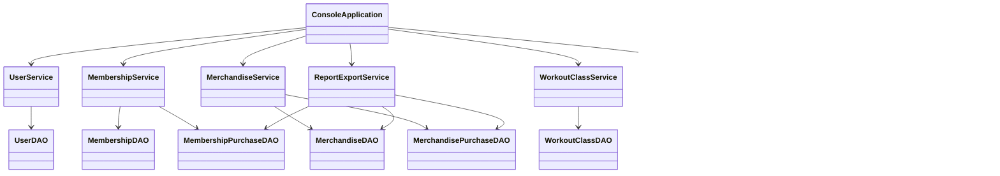
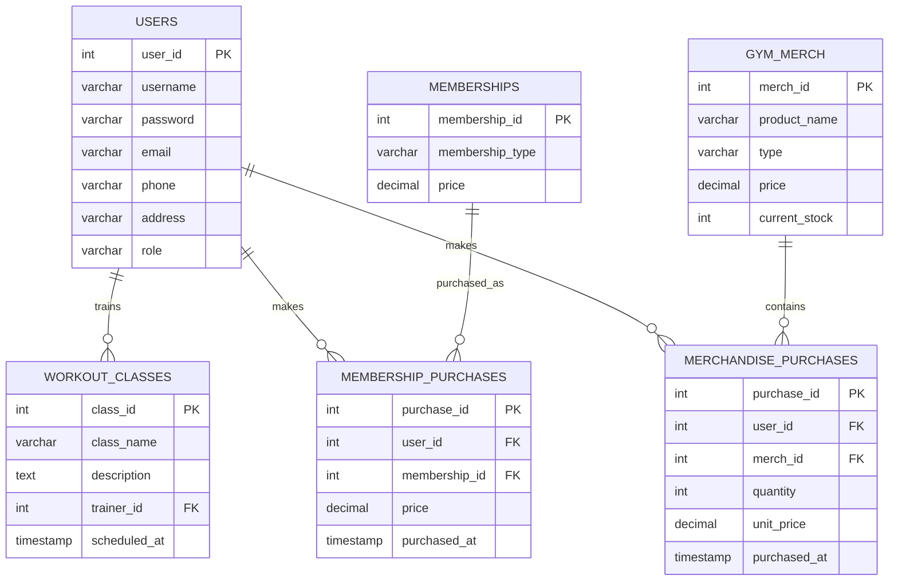

# Gym Management System — Developer Guide

## 1. Architecture Overview

The application follows a layered console application architecture:

```text
+-------------------------+
| ConsoleApplication      |
| Console UI / workflows  |
+------------+------------+
             |
             v
+-------------------------+
| Service Layer           |
| UserService             |
| MembershipService       |
| MerchandiseService      |
| WorkoutClassService     |
| ReportExportService     |
| AuthorizationService    |
| RoleMenuService         |
+------------+------------+
             |
             v
+-------------------------+
| DAO Layer               |
| UserDAO                 |
| MembershipDAO           |
| MembershipPurchaseDAO   |
| MerchandiseDAO          |
| MerchandisePurchaseDAO  |
| WorkoutClassDAO         |
+------------+------------+
             |
             v
+-------------------------+
| DatabaseConnection      |
| JDBC                    |
+------------+------------+
             |
             v
+-------------------------+
| PostgreSQL              |
| gym_management_db       |
+-------------------------+
```

The model classes represent the domain entities used by the DAOs and services.

## 2. Project Structure

```text
src/
  main/java/com/keyingym/
    ConsoleApplication.java
    config/
      AppLogger.java
      DatabaseConnection.java
    dao/
      MembershipDAO.java
      MembershipPurchaseDAO.java
      MerchandiseDAO.java
      MerchandisePurchaseDAO.java
      UserDAO.java
      WorkoutClassDAO.java
    model/
      Membership.java
      MembershipPurchase.java
      Merchandise.java
      MerchandisePurchase.java
      User.java
      UserRole.java
      WorkoutClass.java
    service/
      AuthorizationService.java
      MembershipService.java
      MerchandiseService.java
      ReportExportService.java
      RoleMenuService.java
      UserService.java
      WorkoutClassService.java

  test/java/com/keyingym/
    ... unit and DAO/service tests ...

database/
  schema.sql
  seed.sql
  test-data.sql

reports/
  membership-revenue-report.txt
  merchandise-inventory-report.txt
  merchandise-sales-report.txt

app.log
pom.xml
```

## 3. Class Design

### Models

- `User` represents an application user.
- `UserRole` defines `ADMIN`, `TRAINER`, and `MEMBER` roles.
- `Membership` represents a membership plan.
- `MembershipPurchase` represents a user's completed membership purchase.
- `Merchandise` represents an inventory item.
- `MerchandisePurchase` represents a merchandise purchase.
- `WorkoutClass` represents a scheduled workout class.

### DAO Layer

DAOs isolate PostgreSQL/JDBC operations from the rest of the application.

- `UserDAO` handles user records and authentication lookup.
- `MembershipDAO` handles membership plans.
- `MembershipPurchaseDAO` handles membership purchase records.
- `MerchandiseDAO` handles inventory records.
- `MerchandisePurchaseDAO` handles merchandise purchase records.
- `WorkoutClassDAO` handles workout class CRUD operations.

### Service Layer

Services contain application-level workflows and validation around the DAO operations.

- `UserService` manages registration, authentication, user lookup, and deletion.
- `MembershipService` manages membership plans, purchases, user purchases, and revenue data.
- `MerchandiseService` manages merchandise CRUD and purchase workflows.
- `WorkoutClassService` manages class CRUD and trainer assignment filtering.
- `AuthorizationService` defines role permissions.
- `RoleMenuService` builds role-specific console menus.
- `ReportExportService` reads database data and writes text reports.

### Role-Based Access Control

`AuthorizationService` contains explicit permission checks for Admin, Trainer, and Member. `RoleMenuService` uses those checks to construct the visible menu for the authenticated role.

This prevents unauthorized options from appearing in a user's role-specific menu.

## 4. UML Class Diagram

The following Mermaid diagram summarizes the principal application relationships:



## 5. Database Design

The database is PostgreSQL and is accessed through JDBC.

### Tables

#### `users`

- `user_id` — SERIAL PRIMARY KEY
- `username` — VARCHAR(50), UNIQUE, NOT NULL
- `password` — VARCHAR(60), NOT NULL
- `email` — VARCHAR(150), UNIQUE, NOT NULL
- `phone` — VARCHAR(25), NOT NULL
- `address` — VARCHAR(255), NOT NULL
- `role` — VARCHAR(20), restricted to `ADMIN`, `TRAINER`, or `MEMBER`

#### `memberships`

- `membership_id` — SERIAL PRIMARY KEY
- `membership_type` — VARCHAR(50), UNIQUE, NOT NULL
- `price` — NUMERIC(10,2), non-negative

#### `workout_classes`

- `class_id` — SERIAL PRIMARY KEY
- `class_name` — VARCHAR(100), NOT NULL
- `description` — TEXT, NOT NULL
- `trainer_id` — INTEGER, foreign key to `users.user_id`
- `scheduled_at` — TIMESTAMP, NOT NULL

#### `gym_merch`

- `merch_id` — SERIAL PRIMARY KEY
- `product_name` — VARCHAR(100), NOT NULL
- `type` — VARCHAR(50), NOT NULL
- `price` — NUMERIC(10,2), non-negative
- `current_stock` — INTEGER, non-negative

#### `membership_purchases`

- `purchase_id` — SERIAL PRIMARY KEY
- `user_id` — INTEGER, foreign key to `users.user_id`
- `membership_id` — INTEGER, foreign key to `memberships.membership_id`
- `price` — NUMERIC(10,2), non-negative
- `purchased_at` — TIMESTAMP

#### `merchandise_purchases`

- `purchase_id` — SERIAL PRIMARY KEY
- `user_id` — INTEGER, foreign key to `users.user_id`
- `merch_id` — INTEGER, foreign key to `gym_merch.merch_id`
- `quantity` — INTEGER, must be greater than zero
- `unit_price` — NUMERIC(10,2), non-negative
- `purchased_at` — TIMESTAMP

### ERD



## 6. Setup Instructions

### Requirements

- JDK 17 or later.
- PostgreSQL.
- Maven.
- Git.

### Clone the Repository

```bash
git clone https://github.com/feraszen/SDJAVA-FinalSummer2026-FerasZen-DarrellDeclaro.git
cd SDJAVA-FinalSummer2026-FerasZen-DarrellDeclaro
```

### Create the Database

Create a PostgreSQL database named:

```text
gym_management_db
```

Apply the schema:

```bash
psql -U postgres -d gym_management_db -f database/schema.sql
```

If `psql` is not on the PATH on Windows, use the PostgreSQL installation path, for example:

```bash
"C:/Program Files/PostgreSQL/17/bin/psql.exe" -U postgres -d gym_management_db -f database/schema.sql
```

Load sample data with:

```bash
"C:/Program Files/PostgreSQL/17/bin/psql.exe" -U postgres -d gym_management_db -f database/test-data.sql
```

`test-data.sql` creates sample Admin, Trainer, and Member records and supporting membership, merchandise, purchase, and workout-class data.

### Configure Environment Variables

The application requires all three variables below:

```bash
export GYM_DB_URL="jdbc:postgresql://localhost:5432/gym_management_db"
export GYM_DB_USER="postgres"
export GYM_DB_PASSWORD="YOUR_POSTGRES_PASSWORD"
```

Do not place a real password in source code or commit it to GitHub.

### Build

```bash
mvn clean package
```

### Run

The application can be run from the compiled classes with the PostgreSQL JDBC dependency available on the classpath. One Windows Git Bash example is:

```bash
java -cp "target/classes;target/dependency/*" com.keyingym.ConsoleApplication
```

The project also contains a Maven-built JAR in the supplied build output.

## 7. Dependencies

The `pom.xml` defines:

- PostgreSQL JDBC driver `org.postgresql:postgresql:42.7.13` — PostgreSQL connectivity.
- `org.mindrot:jbcrypt:0.4` — BCrypt password hashing and verification.
- JUnit Jupiter `5.13.4` — automated tests.
- Maven Compiler Plugin `3.14.1` — Java 17 compilation.
- Maven Surefire Plugin `3.5.4` — running JUnit tests.

## 8. Logging Setup

`AppLogger` uses `java.util.logging` and a persistent `FileHandler` writing to:

```text
app.log
```

The logger is configured with append mode so previous log records remain available between application runs.

The project log contains examples of:

- System startup events.
- Failed login attempts.
- Report export events.
- Other application events recorded by the application.

Database and application exceptions can be logged through the `AppLogger.error(...)` method.

Logging is preferable to relying only on console output because persistent logs can be reviewed after the application exits.

## 9. File Export Implementation

`ReportExportService` implements the Admin file-export challenge.

The implementation:

1. Reads current data through DAOs.
2. Builds human-readable report text.
3. Calls `Files.createDirectories(...)` for the `reports` directory.
4. Writes the report using `Files.writeString(...)`.
5. Logs the successful export through `AppLogger`.

Using the `Files` API avoids manually managing a long-lived writer in this implementation. If a manually opened stream is not closed, resources may remain allocated and output may not be fully flushed before a crash or abnormal termination. The `Files.writeString(...)` convenience operation handles the underlying file resource management for the operation.

## 10. Testing

The repository contains JUnit tests for models, DAOs, services, authorization, menus, report export, and console application behavior.

The supplied Maven Surefire results in the project build output show the test classes completing with zero failures and zero errors in the captured test run.

In addition to automated tests, the application was manually exercised for Admin, Trainer, and Member workflows, including CRUD operations, purchases, inventory updates, role-specific menus, and report exports.
