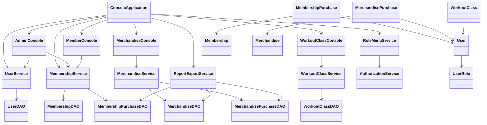
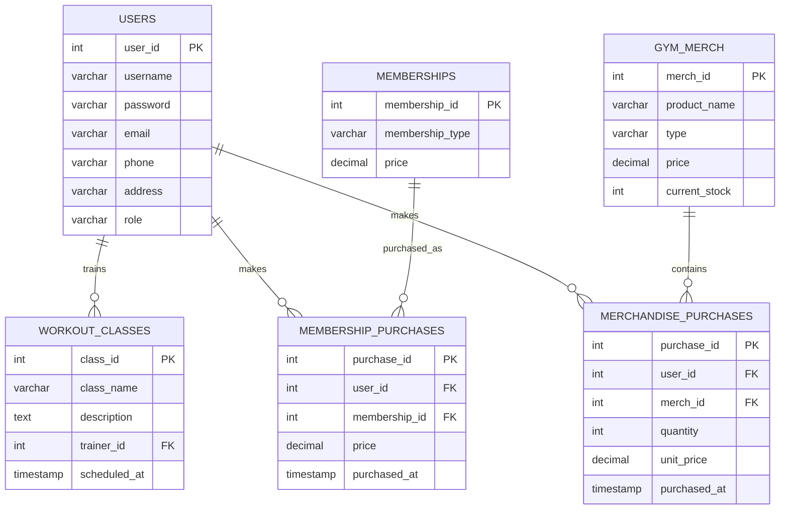

# Gym Management System — Developer Guide

## 1. Architecture Overview

The application follows a layered console application architecture:

```text
+-------------------------+
| ConsoleApplication      |
| Console UI / workflows  |
+------------+------------+
             |
             v
+-------------------------+
| Service Layer           |
| UserService             |
| MembershipService       |
| MerchandiseService      |
| WorkoutClassService     |
| ReportExportService     |
| AuthorizationService    |
| RoleMenuService         |
+------------+------------+
             |
             v
+-------------------------+
| DAO Layer               |
| UserDAO                 |
| MembershipDAO           |
| MembershipPurchaseDAO   |
| MerchandiseDAO          |
| MerchandisePurchaseDAO  |
| WorkoutClassDAO         |
+------------+------------+
             |
             v
+-------------------------+
| DatabaseConnection      |
| JDBC                    |
+------------+------------+
             |
             v
+-------------------------+
| PostgreSQL              |
| gym_management_db       |
+-------------------------+
```

The model classes represent the domain entities used by the DAOs and services.

## 2. Project Structure

```text
src/
  main/java/com/keyingym/
    ConsoleApplication.java
    config/
      AppLogger.java
      DatabaseConnection.java
    console/
      AdminConsole.java
      ConsoleInput.java
      MemberConsole.java
      MerchandiseConsole.java
      WorkoutClassConsole.java
    dao/
      MembershipDAO.java
      MembershipPurchaseDAO.java
      MerchandiseDAO.java
      MerchandisePurchaseDAO.java
      UserDAO.java
      WorkoutClassDAO.java
    model/
      Membership.java
      MembershipPurchase.java
      Merchandise.java
      MerchandisePurchase.java
      User.java
      UserRole.java
      WorkoutClass.java
    service/
      AuthorizationService.java
      MembershipService.java
      MerchandiseService.java
      ReportExportService.java
      RoleMenuService.java
      UserService.java
      WorkoutClassService.java

  test/java/com/keyingym/
    ... unit and DAO/service tests ...

database/
  schema.sql
  seed.sql
  test-data.sql

docs/
  user_guide.md
  developer_guide.md
  individual-reports/

pom.xml
```

Generated report files are runtime artifacts. The application creates the `reports/` directory when an export is requested; generated `.txt` files are not required to be committed to the repository.

## 3. Class Design

### Models

- `User` represents an application user.
- `UserRole` defines `ADMIN`, `TRAINER`, and `MEMBER` roles.
- `Membership` represents a membership plan.
- `MembershipPurchase` represents a user's completed membership purchase.
- `Merchandise` represents an inventory item and provides `getInventoryValue()` for price × current stock.
- `MerchandisePurchase` represents a merchandise purchase.
- `WorkoutClass` represents a scheduled workout class.

### Console Layer

- `ConsoleApplication` handles startup, registration, authentication, navigation, and report-export dispatch.
- `AdminConsole` handles Admin user and membership-revenue workflows.
- `MemberConsole` handles Member membership and expense workflows.
- `MerchandiseConsole` handles merchandise inventory and purchase workflows.
- `WorkoutClassConsole` handles workout-class workflows.
- `ConsoleInput` centralizes console parsing and validation helpers.

### DAO Layer

DAOs isolate PostgreSQL/JDBC operations from the rest of the application.

- `UserDAO` handles user records and authentication lookup.
- `MembershipDAO` handles membership plans.
- `MembershipPurchaseDAO` handles membership purchase records, including the current-calendar-year query.
- `MerchandiseDAO` handles inventory records.
- `MerchandisePurchaseDAO` handles merchandise purchase records.
- `WorkoutClassDAO` handles workout class CRUD operations.

Database transaction errors are logged through `AppLogger.error(...)` rather than `printStackTrace()`.

### Service Layer

Services contain application-level workflows and validation around DAO operations.

- `UserService` manages registration, authentication, user lookup, and deletion.
- `MembershipService` manages membership plans, purchases, user purchases, and current-year revenue data.
- `MerchandiseService` manages merchandise CRUD and purchase workflows.
- `WorkoutClassService` manages class CRUD and trainer assignment rules.
- `AuthorizationService` defines role permissions.
- `RoleMenuService` builds role-specific console menus.
- `ReportExportService` reads database data and writes human-readable text reports.

### Role-Based Access Control

`AuthorizationService` contains explicit permission checks for Admin, Trainer, and Member. `RoleMenuService` builds the visible role-specific menu for the authenticated user.

Sensitive workflow boundaries also perform role checks. Self-service registration always creates a `MEMBER` account and does not allow a registering user to select `ADMIN` or `TRAINER`. Merchandise purchase workflow boundaries accept only `MEMBER` and `TRAINER` users.

Trainer workout-class update and delete operations are restricted to classes assigned to the logged-in trainer.

## 4. UML Class Diagram

The following Mermaid diagram summarizes the principal application relationships:



## 5. Database Design

The database is PostgreSQL and is accessed through JDBC.

### Tables

#### `users`

- `user_id` — SERIAL PRIMARY KEY
- `username` — VARCHAR(50), UNIQUE, NOT NULL
- `password` — VARCHAR(60), NOT NULL
- `email` — VARCHAR(150), UNIQUE, NOT NULL
- `phone` — VARCHAR(25), NOT NULL
- `address` — VARCHAR(255), NOT NULL
- `role` — VARCHAR(20), restricted to `ADMIN`, `TRAINER`, or `MEMBER`

#### `memberships`

- `membership_id` — SERIAL PRIMARY KEY
- `membership_type` — VARCHAR(50), UNIQUE, NOT NULL
- `price` — NUMERIC(10,2), non-negative

#### `workout_classes`

- `class_id` — SERIAL PRIMARY KEY
- `class_name` — VARCHAR(100), NOT NULL
- `description` — TEXT, NOT NULL
- `trainer_id` — INTEGER, foreign key to `users.user_id`
- `scheduled_at` — TIMESTAMP, NOT NULL

#### `gym_merch`

- `merch_id` — SERIAL PRIMARY KEY
- `product_name` — VARCHAR(100), NOT NULL
- `type` — VARCHAR(50), NOT NULL
- `price` — NUMERIC(10,2), non-negative
- `current_stock` — INTEGER, non-negative

#### `membership_purchases`

- `purchase_id` — SERIAL PRIMARY KEY
- `user_id` — INTEGER, foreign key to `users.user_id`
- `membership_id` — INTEGER, foreign key to `memberships.membership_id`
- `price` — NUMERIC(10,2), non-negative
- `purchased_at` — TIMESTAMP

#### `merchandise_purchases`

- `purchase_id` — SERIAL PRIMARY KEY
- `user_id` — INTEGER, foreign key to `users.user_id`
- `merch_id` — INTEGER, foreign key to `gym_merch.merch_id`
- `quantity` — INTEGER, must be greater than zero
- `unit_price` — NUMERIC(10,2), non-negative
- `purchased_at` — TIMESTAMP

### ERD



## 6. Setup Instructions

### Requirements

- JDK 17 or later.
- PostgreSQL.
- Maven.
- Git.

### Create the Database

Create a PostgreSQL database named:

```text
gym_management_db
```

Apply the schema:

```text
psql -U postgres -d gym_management_db -f database/schema.sql
```

Load sample data when required:

```text
psql -U postgres -d gym_management_db -f database/test-data.sql
```

`seed.sql` provides base reference data. `test-data.sql` provides full demonstration/test data.

### Configure Environment Variables

The application requires:

```text
GYM_DB_URL
GYM_DB_USER
GYM_DB_PASSWORD
```

Configure them locally before starting the application. Do not place real database credentials in source code or commit them to GitHub.

## 7. Maven Build and Run

Build the project with:

```bash
mvn clean package
```

The Maven Shade Plugin creates an executable JAR containing the application dependencies. The verified primary run command is:

```bash
java -jar target/gym-management-system-1.0-SNAPSHOT.jar
```

The older `target/dependency/*` classpath command is not the primary run instruction because the current Maven configuration does not copy dependencies into that directory.

## 8. Dependencies

The `pom.xml` defines:

- PostgreSQL JDBC driver `org.postgresql:postgresql:42.7.13` — PostgreSQL connectivity.
- `org.mindrot:jbcrypt:0.4` — BCrypt password hashing and verification.
- JUnit Jupiter `5.13.4` — automated tests.
- Maven Compiler Plugin `3.14.1` — Java 17 compilation.
- Maven Surefire Plugin `3.5.4` — running JUnit tests.
- Maven Shade Plugin `3.6.0` — executable JAR creation.

## 9. Logging Setup

`AppLogger` uses `java.util.logging` and a persistent `FileHandler` writing to:

```text
app.log
```

The logger records application events including system startup, failed login attempts, report exports, Admin overrides, and database transaction errors handled by DAO classes.

Persistent logging is preferable to relying only on console output because log records can be reviewed after the application exits.

## 10. File Export Implementation

`ReportExportService` implements the Admin file-export challenge.

The implementation:

1. Reads current database data through DAOs.
2. Builds human-readable report text.
3. Calls `Files.createDirectories(...)` for the `reports` directory.
4. Writes the report using `Files.writeString(...)`.
5. Logs the successful export through `AppLogger`.

The membership revenue report uses the current-calendar-year definition. `MembershipPurchaseDAO.getCurrentYearMembershipPurchases()` limits the query to the start of the current year through the start of the next year.

The merchandise inventory report includes per-item inventory value and total inventory valuation. `Merchandise.getInventoryValue()` calculates price multiplied by current stock.

The `reports` directory and generated report files are runtime artifacts. They are created when the Admin uses the export workflow and are not required to be present in the repository beforehand.

Using `Files.writeString(...)` avoids leaving a manually opened writer unclosed in this implementation. If manually opened streams are used elsewhere, they must be closed so resources are released and buffered output is flushed.

## 11. Testing

The repository contains JUnit tests for models, DAOs, services, authorization, menus, report export, and console application behavior.

The final audit added coverage for:

- Member registration workflow.
- Current-year membership revenue service data.
- Current-year membership revenue report export.
- Per-item merchandise inventory valuation.
- Total merchandise inventory valuation.

The previous verified baseline was 42 tests with zero failures/errors. The current branch contains additional tests and therefore should exceed that baseline when the final Maven build is run locally.

A complete final manual pass should also verify Admin, Trainer, and Member workflows against the final database state.
